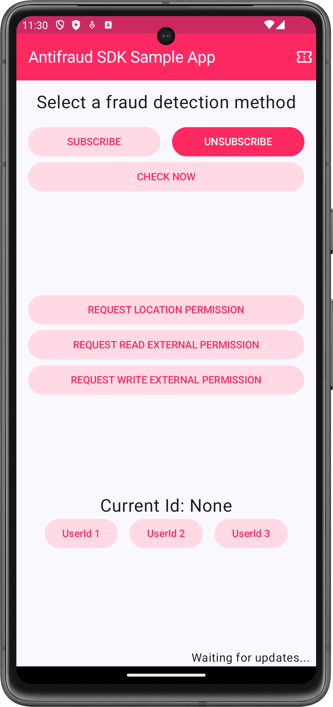
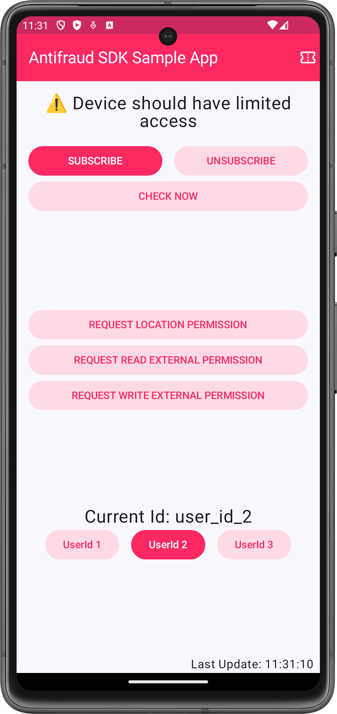

# Bespot Gatekeeper Android SDK

[](#)
[](#)

Bespot Gatekeeper is a highly customizable fraud prevention and geolocation verification platform for mobile and web applications. It verifies user locations, detects device integrity issues, and monitors network connections to help organizations—particularly in the iGaming, Media Streaming, and Financial Services industries—comply with regulations and protect digital transactions from fraud.

## Features

Refer to our [documentation](https://gatekeeper.docs.bespot.com/overview/features/) for the latest list of fraud detection capabilities available across platforms.

## Install the library



Add the following lines to the `dependencyResolutionManagement` block in your `settings.gradle.kts` file, or to the `repositories` block in the root `build.gradle.kts` file if you're using the legacy structure.

```kotlin
dependencyResolutionManagement {
    maven(url = "https://artifactory.bespot.com/artifactory/bespot-antifraud")
    maven(url = "https://artifactory.bespot.com/artifactory/bespot-logger")
    maven(url = "https://jitpack.io" )
}
```

_The `bespot-logger` dependency enables logging to assist our developers with debugging, while the `jitpack` dependency supports certain SDK components. We plan to remove these dependencies in a future update._

Next, add the following dependency to your app’s `build.gradle.kts` file.
```kotlin
dependencies {
    implementation("com.bespot.antifraud:sdk-android:$latest_version")
}
```

Finally, include the following, `API_KEY`, `API_URL`, `CLIENT_ID`, `CLIENT_SECRET` and `OAUTH2_TOKEN_URL` as `resValues` entries in your app’s `build.gradle.kts` file:

```kotlin
resValue("string", "antifraud_sdk_key", YOUR_API_KEY)
resValue("string", "antifraud_sdk_api_url", API_URL)
resValue("string", "antifraud_sdk_client_id", YOUR_CLIENT_ID)
resValue("string", "antifraud_sdk_client_secret", YOUR_CLIENT_SECRET)
resValue("string", "antifraud_sdk_oauth2_token_url", OAUTH2_TOKEN_URL)
```
or via your app's `strings.xml` file
```xml
<string name="antifraud_sdk_key">YOUR_API_KEY</string>
<string name="antifraud_sdk_api_url"> API_URL</string>
<string name="antifraud_sdk_client_id">YOUR_CLIENT_ID</string>
<string name="antifraud_sdk_client_secret"> YOUR_CLIENT_SECRET</string>
<string name="antifraud_sdk_oauth2_token_url">OAUTH2_TOKEN_URL</string>
```
## Usage



Depending on your fraud prevention strategy, the Gatekeeper SDK requires the following permissions:
- [Fine Location](https://developer.android.com/reference/android/Manifest.permission#ACCESS_FINE_LOCATION)
- [Coarse Location](https://developer.android.com/reference/android/Manifest.permission#ACCESS_COARSE_LOCATION)
- [External Storage](https://developer.android.com/reference/android/Manifest.permission#WRITE_EXTERNAL_STORAGE) 
- [Audio Media](https://developer.android.com/reference/android/Manifest.permission#READ_MEDIA_AUDIO)

The Gatekeeper SDK provides the following methods for use in client applications:

### Check
This method performs a single check for fraudulent activities. It should be used when the application need to verify a specific user action, ex. the user clicks a button in your app.
The `check` method uses a `FraudulentCheckObserver` callback which can be used for handling the Actions returned from our service or possible Failures.
```kotlin
safeSdk.check(object : FraudulentCheckObserver {
    override fun onSuccess(action: Action, signature: String) {
        // Your onSuccess logic
    }

    override fun onError(error: Failure) {
        // Your onError logic
    }
}
)
```

### Subscribe
This method initializes a subscription to periodic detections, running at a configurable interval (as low as 1 second), which can be customized per application. It’s ideal for continuously monitoring changes in the device’s fraud detection state over time, rather than responding to specific user actions.
The `subscribe` method relies on a `FraudulentSessionObserver` callback to handle both the Actions returned by our service and any potential Failures.

```kotlin
safeSdk.subscribe(object : FraudulentSessionObserver {
    override fun perform(action: Action, signature: String) {
        // Your onSuccess logic
    }

    override fun onError(error: Failure) {
        // Your onError logic
    }
}
)
```

### Unsubscribe
This method ends the subscription at regular intervals.
```kotlin
safeSdk.unsubscribe()
```
### Identify user (SetUserId)
This method sets a `String` value as the User ID. It’s recommended to use a unique identifier, such as an account ID, player ID, or loyalty number.
```kotlin
safeSdk.setUserId(id: String)
```

### Logging
This method enables logging for our service and should be used only in debug builds.
```kotlin
safeSdk.logging(enable: Boolean)
```

_Since the Callbacks used in the `check` and `subscribe` methods are similar, they will be unified in a future update._

## Errors
When an error occurs, the `check` and `subscribe` methods return the following objects, which should be properly handled:
```kotlin
when (error) {
    is Failure.NetworkConnection -> // Connection Error
    is Failure.NoActiveApiKey -> // The Api Key is either disabled or wrong
    is Failure.NoChecksAvailableFailure -> // The server did not find available Checks
    is Failure.NoRecipeFoundFailure -> // The application does not have a valid Recipe
    is Failure.NotInitialized -> // The SDK is not initialized
    is Failure.ServerError -> // Remote Server Error
    is Failure.UnknownError -> // Unknown Error (see Support section)
}
```

## Support
We use [Github issues](https://github.com/bespot/Antifraud-SDK-Android-Release/issues) to track bugs and feature requests.

- If you encounter a bug, please open an issue and include as much detail as possible.
- If you have a feature suggestion or improvement idea, feel free to submit it as a proposal.


## License
© 2025 [Bespot](https://bespot.com/) Private Company. All rights reserved. See `LICENSE` for more information.
