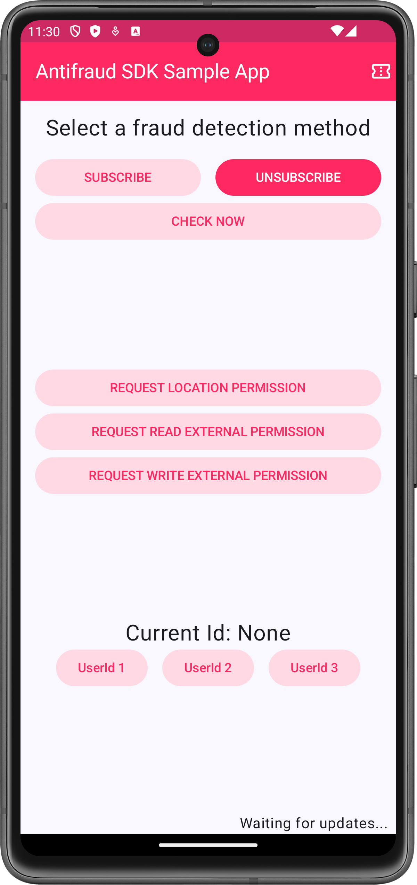
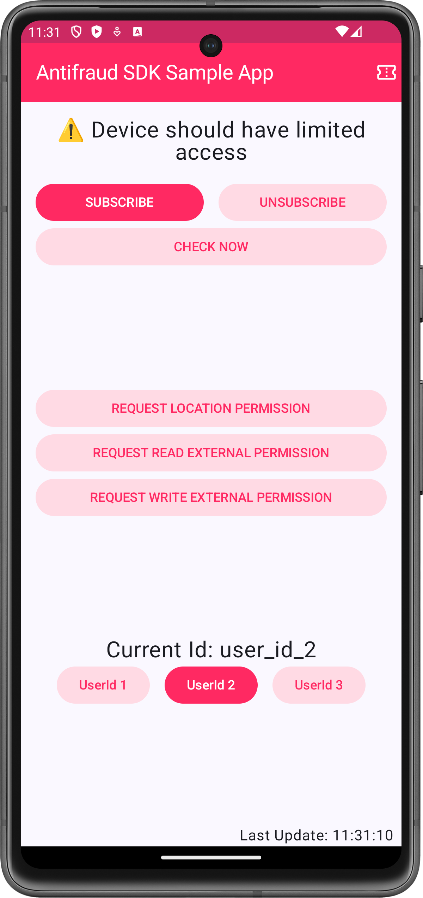

# Bespot Gatekeeper Android SDK

[](#)
[](#)

Bespot Gatekeeper is a highly customizable fraud prevention and geolocation verification platform for mobile and web applications. It verifies user locations, detects device integrity issues, and monitors network connections to help organizations—particularly in the iGaming, Media Streaming, and Financial Services industries—comply with regulations and protect digital transactions from fraud.

## Features

Refer to our [documentation](https://gatekeeper.docs.bespot.com/overview/features/) for the latest list of fraud detection capabilities available across platforms.

## Install the library



Add the following lines to the `dependencyResolutionManagement` block in your `settings.gradle.kts` file, or to the `repositories` block in the root `build.gradle.kts` file if you're using the legacy structure.

```kotlin
dependencyResolutionManagement {
    maven(url = "https://artifactory.bespot.com/artifactory/bespot-antifraud")
    maven(url = "https://artifactory.bespot.com/artifactory/bespot-logger")
    maven(url = "https://jitpack.io")
}
```

_The `bespot-logger` dependency enables logging to assist our developers with debugging, while the `jitpack` dependency supports certain SDK components. We plan to remove these dependencies in a future update._

Next, add the following dependency to your app's `build.gradle.kts` file.

```kotlin
dependencies {
    implementation("com.bespot.antifraud:sdk-android:$latest_version")
}
```

Finally, configure the SDK credentials as `resValues` in your app's `build.gradle.kts` file.

**OAuth mode** (SDK authenticates automatically via client credentials):

```kotlin
resValue("string", "antifraud_sdk_key", YOUR_API_KEY)
resValue("string", "antifraud_sdk_api_url", YOUR_API_URL)
resValue("string", "antifraud_sdk_client_id", YOUR_CLIENT_ID)
resValue("string", "antifraud_sdk_client_secret", YOUR_CLIENT_SECRET)
resValue("string", "antifraud_sdk_oauth2_token_url", OAUTH2_TOKEN_URL)
```

**Access token mode** (your app supplies the bearer token — `API_KEY` and `API_URL` are still **required**; leave OAuth values empty):

```kotlin
resValue("string", "antifraud_sdk_key", YOUR_API_KEY)       // required
resValue("string", "antifraud_sdk_api_url", YOUR_API_URL)   // required
resValue("string", "antifraud_sdk_client_id", "")
resValue("string", "antifraud_sdk_client_secret", "")
resValue("string", "antifraud_sdk_oauth2_token_url", "")
```

The same keys can be provided via `strings.xml` (for access token mode, leave OAuth entries empty):

```xml
<string name="antifraud_sdk_key">YOUR_API_KEY</string>
<string name="antifraud_sdk_api_url">YOUR_API_URL</string>
<string name="antifraud_sdk_client_id">YOUR_CLIENT_ID</string>
<string name="antifraud_sdk_client_secret">YOUR_CLIENT_SECRET</string>
<string name="antifraud_sdk_oauth2_token_url">OAUTH2_TOKEN_URL</string>
```

> **Warning**
>
> The library specifies custom backup rules that prevent backing up certain sensitive files. If your application has custom backup rules, add the following rule:
>
> ```
> <exclude domain="sharedpref" path="com.bespot.shared.settings.xml" />
> ```

## Authentication

Regardless of auth mode, **`apiKey`** and **`apiBaseUrl`** are always required to identify your application and environment.

Choose **one** init path — OAuth **or** access token:

- **OAuth** — configure OAuth `resValues`; the SDK auto-starts on launch via the manifest `ContentProvider`
- **Access token** — configure `apiKey` and `apiBaseUrl` only (leave OAuth `resValues` empty); call `SafeSdk.initWithAccessToken(...)` after login or at startup if the token is already available

**SDK behaviour on launch**

- **OAuth** — network init + device registration start immediately
- **Access token** — local setup on launch; network init starts when you call `initWithAccessToken`

Use `SafeSdk.setAccessToken(...)` to refresh the bearer token without re-registering the device or restarting periodic checks.

**Token validation and error delivery**

Access-token validation (blank/whitespace token, missing `apiKey`/`apiBaseUrl`) runs in the shared SDK layer. Invalid input is never thrown as an uncaught exception.

`initWithAccessToken` and `setAccessToken` are **fire-and-forget**. Failures are delivered to a registered observer via `subscribe` or `check` — register one **before or when** calling init if you need to handle init/registration failures.

**Token lifecycle**

- **Same session, new token** → `setAccessToken`
- **New login, not yet registered** → `initWithAccessToken`
- **Repeat init after successful registration** → `AlreadyInitialized` (via observer) — use `setAccessToken` instead

`initWithAccessToken` may be called again only if the previous attempt did **not** complete device registration (e.g. invalid token).

## Usage



Depending on your fraud prevention strategy, the Gatekeeper SDK requires the following permissions:

- [Fine Location](https://developer.android.com/reference/android/Manifest.permission#ACCESS_FINE_LOCATION)
- [Coarse Location](https://developer.android.com/reference/android/Manifest.permission#ACCESS_COARSE_LOCATION)
- [External Storage](https://developer.android.com/reference/android/Manifest.permission#WRITE_EXTERNAL_STORAGE)
- [Audio Media](https://developer.android.com/reference/android/Manifest.permission#READ_MEDIA_AUDIO)

The SDK starts automatically via the manifest `ContentProvider`. `antifraud_sdk_key` and `antifraud_sdk_api_url` must always be set (see [Authentication](#authentication)).

### InitWithAccessToken

Use this instead of OAuth when your app supplies the bearer token. Requires `apiBaseUrl`, `apiKey`, and the bearer token.
Call after login, or immediately at startup if the token is already available. Performs network setup and device registration.

```kotlin
SafeSdk.initWithAccessToken(
    apiBaseUrl = "your_api_url",
    apiKey = "your_api_key",
    token = "your_bearer_token",
)
```

You may read `apiBaseUrl` and `apiKey` from your `resValues` if already configured there.

> After device registration succeeds, further `initWithAccessToken` calls report `Failure.AlreadyInitialized` via a registered observer — use `setAccessToken` to update the bearer token instead.
> Blank or whitespace-only tokens report `Failure.InvalidToken` via a registered `FraudulentCheckObserver` (`subscribe` or `check`).
> Registration failures (e.g. `InvalidToken`, `AuthError`) are reported the same way — not as return values from `initWithAccessToken`.

### SetAccessToken

Updates the bearer token used on subsequent API requests **without** re-registering the device or restarting periodic checks.
Use this when the session token is refreshed while the user remains logged in.

```kotlin
SafeSdk.setAccessToken("your_refreshed_token")
```

> Reports `Failure.NotInitialized` via observer if called before the network layer is initialized.
> When initialized with OAuth, `setAccessToken` is ignored by the network layer (no-op) — OAuth manages the token automatically.
> Blank or whitespace-only tokens report `Failure.InvalidToken` via observer on the next `check` or `subscribe` callback.
> Other auth failures (e.g. `Failure.AuthError`) are also reported on the next `check` or `subscribe` call, not from `setAccessToken` itself.

### Check

This method performs a single check for fraudulent activities. It should be used when the application needs to verify a specific user action, e.g. the user clicks a button in your app.
The `check` method uses a `FraudulentCheckObserver` callback which can be used for handling the Actions returned from our service or possible Failures.

> Reports `Failure.NotInitialized` if the network layer is not ready (e.g. access token mode before `initWithAccessToken`).
> Reports `Failure.InvalidToken` for blank/whitespace tokens (client-side) or when the API explicitly rejects the bearer token.
> Reports `Failure.AuthError` for generic auth failures (HTTP 401/403, access denied).

```kotlin
SafeSdk.check(object : FraudulentCheckObserver {
    override fun onSuccess(action: Action, signature: String) {
        // Your onSuccess logic
    }

    override fun onError(error: Failure) {
        // Your onError logic
    }
})
```

### Subscribe

This method initializes a subscription to the periodic check process. Use it to monitor how the user's device fraud detection state changes over time, rather than for a single user action.
The `subscribe` method uses a `FraudulentCheckObserver` callback for handling Actions and Failures.

```kotlin
SafeSdk.subscribe(object : FraudulentCheckObserver {
    override fun onSuccess(action: Action, signature: String) {
        // Your onSuccess logic
    }

    override fun onError(error: Failure) {
        // Your onError logic
    }
})
```

### Unsubscribe

This method cancels the subscription mentioned above.

```kotlin
SafeSdk.unsubscribe()
```

### SetUserId

This method sets a `String` value as the User ID. It is recommended to use a unique identifier, such as an account ID, player ID, or loyalty number.

```kotlin
SafeSdk.setUserID("user_id")
```

### Logging

This method enables logging for our service and should be used only in debug builds.

```kotlin
SafeSdk.logging(true)
```

## Errors

When an error occurs, the `check` and `subscribe` methods return the following objects, which should be properly handled:

```kotlin
when (error) {
    is Failure.NetworkConnection -> // Connection Error
    is Failure.NoActiveApiKey -> // The Api Key is either disabled or wrong
    is Failure.NoChecksAvailableFailure -> // The server did not find available Checks
    is Failure.NoRecipeFoundFailure -> // The application does not have a valid Recipe
    is Failure.NotInitialized -> // Network layer not ready (check/setAccessToken before init)
    is Failure.InvalidToken -> // Blank/whitespace token (client-side) or API-rejected bearer token
    is Failure.AuthError -> // Generic auth error (HTTP 401/403, access denied)
    is Failure.AlreadyInitialized -> // Repeat initWithAccessToken after successful registration
    is Failure.ServerError -> // Remote Server Error
    is Failure.UnknownError -> // Unknown Error (see Support section)
}
```

`Failure.AlreadyInitialized` includes:

- `initializedWith` — mode from the first successful init (`ACCESS_TOKEN`, `OAUTH2`)
- `requestedWith` — mode requested on the rejected call

## Support

We use [Github issues](https://github.com/bespot/Antifraud-SDK-Android-Release/issues) to track bugs and feature requests.

- If you encounter a bug, please open an issue and include as much detail as possible.
- If you have a feature suggestion or improvement idea, feel free to submit it as a proposal.

## License

© 2025 [Bespot](https://bespot.com/) Private Company. All rights reserved. See `LICENSE` for more information.
